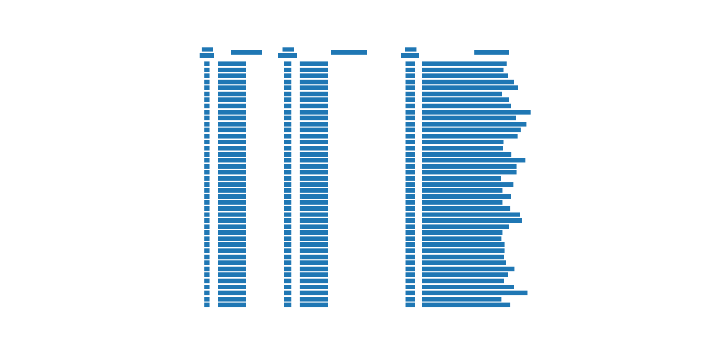

.. _stream:

======
Stream
======

Stream method is the complete opposite of Lattice and works on PDFs which have text placed uniformly apart across rows to simulate a table. It looks for spaces between text to form a table representation.

Stream builds on top of PDFMiner's functionality of grouping characters on a page into words and sentences. After getting these words, it groups them into rows based on their y-coordinates and tries to guess the number of columns a PDF table might have by calculating the mode of the number of words in each row. Additionally, the user can specify the number of columns or column x-coordinates.

Let's run it on this PDF.

::

    >>> from camelot.pdf import Pdf
    >>> from camelot.stream import Stream

    >>> extractor = Stream(Pdf('eu-027.pdf'))
    >>> tables = extractor.get_tables()
    >>> print tables['page-1'][0]

.. .. _this: insert link for eu-027.pdf

.. csv-table::

   "C","Appendix C:...","","",""
   "","Table C1:...","","",""
   "","This table...","","",""
   "Variable","Mean","Std. Dev.","Min","Max"
   "Age","50.8","15.9","21","90"
   "Men","0.47","0.50","0","1"
   "East","0.28","0.45","0","1"
   "Rural","0.15","0.36","0","1"
   "Married","0.57","0.50","0","1"
   "Single","0.21","0.40","0","1"
   "Divorced","0.13","0.33","0","1"
   "Widowed","0.08","0.26","0","1"
   "Separated","0.03","0.16","0","1"
   "Partner","0.65","0.48","0","1"
   "Employed","0.55","0.50","0","1"
   "Fulltime","0.34","0.47","0","1"
   "Parttime","0.20","0.40","0","1"
   "Unemployed","0.08","0.28","0","1"
   "Homemaker","0.19","0.40","0","1"
   "Retired","0.28","0.45","0","1"
   "Household size","2.43","1.22","1","9"
   "Households...","0.37","0.48","0","1"
   "Number of...","1.67","1.38","0","8"
   "Lower...","0.08","0.27","0","1"
   "Upper...","0.60","0.49","0","1"
   "Post...","0.12","0.33","0","1"
   "First...","0.17","0.38","0","1"
   "Other...","0.03","0.17","0","1"
   "Household...","2,127","1,389","22","22,500"
   "Gross...","187,281","384,198","0","7,720,000"
   "Gross...","38,855","114,128","0","2,870,000"
   "","Source:...","","",""
   "","","","","ECB"
   "","","","","Working..."
   "","","","","Febuary..."

But sometimes its guess could be incorrect, like in this case.

::

    >>> from camelot.pdf import Pdf
    >>> from camelot.stream import Stream

    >>> extractor = Stream(Pdf('missing_values.pdf'))
    >>> tables = extractor.get_tables()
    >>> print tables['page-1'][0]

.. .. _this: insert link for missing_values.pdf

.. csv-table::

   "Bhandara...","",""
   "","DLHS-4...","DLHS-3..."
   "Indicators","TOTAL","RURAL TOTAL RURAL"
   "Reported Prevalence of Morbidity","",""
   "Any Injury...","1.9","2.1"
   "Acute Illness...","4.5","5.6"
   "Chronic Illness...","5.1","4.1"
   "Reported Prevalence of Chronic Illness during last one year (%)","",""
   "Disease of respiratory system...","11.7","15.0"
   "Disease of cardiovascular system...","8.9","9.3"
   "Persons suffering from tuberculosis...","2.2","1.5"
   "Anaemia Status by Haemoglobin Level14 (%)","",""
   "Children (6-59 months) having anaemia...","68.5","71.9"
   "Children (6-59 months) having severe anaemia...","6.7","9.4"
   "Children (6-9 Years) having anaemia - Male...","67.1","71.4"
   "Children (6-9 Years) having severe anaemia - Male...","4.4","2.4"
   "Children (6-9 Years) having anaemia - Female...","52.4","48.8"
   "Children (6-9 Years) having severe anaemia - Female...","1.2","0.0"
   "Children (6-14 years) having  anaemia - Male...","50.8","62.5"
   "Children (6-14 years) having severe anaemia - Male...","3.7","3.6"
   "Children (6-14 years) having  anaemia - Female...","48.3","50.0"
   "Children (6-14 years) having severe anaemia - Female...","4.3","6.1"
   "Children (10-19 Years15) having anaemia - Male...","37.9","51.2"
   "Children (10-19 Years15) having severe anaemia - Male...","3.5","4.0"
   "Children (10-19 Years15) having anaemia - Female...","46.6","52.1"
   "Children (10-19 Years15) having severe anaemia - Female...","6.4","6.5"
   "Adolescents (15-19 years) having  anaemia...","39.4","46.5"
   "Adolescents (15-19 years) having severe anaemia...","5.4","5.1"
   "Pregnant women (15-49 aged) having anaemia...","48.8","51.5"
   "Pregnant women (15-49 aged) having severe anaemia...","7.1","8.8"
   "Women (15-49 aged) having anaemia...","45.2","51.7"
   "Women (15-49 aged) having severe anaemia...","4.8","5.9"
   "Persons (20 years and above) having anaemia...","37.8","42.1"
   "Persons (20 years and above) having Severe anaemia...","4.6","4.8"
   "Blood Sugar Level (age 18 years and above) (%)","",""
   "Blood Sugar Level >140 mg/dl (high)...","12.9","11.1"
   "Blood Sugar Level >160 mg/dl (very high)...","7.0","5.1"
   "Hypertension (age 18 years and above) (%)","",""
   "Above Normal Range (Systolic >140 mm of Hg & Diastolic >90 mm of Hg )...","23.8","22.8"
   "Moderately High (Systolic >160 mm of Hg & Diastolic >100 mm of Hg )...","8.2","7.1"
   "Very High (Systolic >180 mm of Hg & Diastolic >110 mm of Hg )...","3.7","3.1"
   "14...","",""
   "Chronic...","",""

It guessed that the PDF has 3 columns, because there wasn't any data in the last 2 columns for most rows. So, let's specify the number of columns explicitly, following which, Stream will only consider rows that have 5 words, to decide on column boundaries.

::

    >>> from camelot.pdf import Pdf
    >>> from camelot.stream import Stream

    >>> extractor = Stream(Pdf('missing_values.pdf'), ncolumns=5)
    >>> tables = extractor.get_tables()
    >>> print tables['page-1'][0]

.. csv-table::

   "Bhandara...","","","",""
   "","DLHS-4...","DLHS-3...","",""
   "Indicators","TOTAL","RURAL","TOTAL","RURAL"
   "Reported Prevalence of Morbidity","","","",""
   "Any Injury...","1.9","2.1","",""
   "Acute Illness...","4.5","5.6","",""
   "Chronic Illness...","5.1","4.1","",""
   "Reported Prevalence of Chronic Illness during last one year (%)","","","",""
   "Disease of respiratory system...","11.7","15.0","",""
   "Disease of cardiovascular system...","8.9","9.3","",""
   "Persons suffering from tuberculosis...","2.2","1.5","",""
   "Anaemia Status by Haemoglobin Level14 (%)","","","",""
   "Children (6-59 months) having anaemia...","68.5","71.9","",""
   "Children (6-59 months) having severe anaemia...","6.7","9.4","",""
   "Children (6-9 Years) having anaemia - Male...","67.1","71.4","",""
   "Children (6-9 Years) having severe anaemia - Male...","4.4","2.4","",""
   "Children (6-9 Years) having anaemia - Female...","52.4","48.8","",""
   "Children (6-9 Years) having severe anaemia - Female...","1.2","0.0","",""
   "Children (6-14 years) having  anaemia - Male...","50.8","62.5","",""
   "Children (6-14 years) having severe anaemia - Male...","3.7","3.6","",""
   "Children (6-14 years) having  anaemia - Female...","48.3","50.0","",""
   "Children (6-14 years) having severe anaemia - Female...","4.3","6.1","",""
   "Children (10-19 Years15) having anaemia - Male...","37.9","51.2","",""
   "Children (10-19 Years15) having severe anaemia - Male...","3.5","4.0","",""
   "Children (10-19 Years15) having anaemia - Female...","46.6","52.1","",""
   "Children (10-19 Years15) having severe anaemia - Female...","6.4","6.5","",""
   "Adolescents (15-19 years) having  anaemia...","39.4","46.5","",""
   "Adolescents (15-19 years) having severe anaemia...","5.4","5.1","",""
   "Pregnant women (15-49 aged) having anaemia...","48.8","51.5","",""
   "Pregnant women (15-49 aged) having severe anaemia...","7.1","8.8","",""
   "Women (15-49 aged) having anaemia...","45.2","51.7","",""
   "Women (15-49 aged) having severe anaemia...","4.8","5.9","",""
   "Persons (20 years and above) having anaemia...","37.8","42.1","",""
   "Persons (20 years and above) having Severe anaemia...","4.6","4.8","",""
   "Blood Sugar Level (age 18 years and above) (%)","","","",""
   "Blood Sugar Level >140 mg/dl (high)...","12.9","11.1","",""
   "Blood Sugar Level >160 mg/dl (very high)...","7.0","5.1","",""
   "Hypertension (age 18 years and above) (%)","","","",""
   "Above Normal Range (Systolic >140 mm of Hg & Diastolic >90 mm of Hg )...","23.8","22.8","",""
   "Moderately High (Systolic >160 mm of Hg & Diastolic >100 mm of Hg )...","8.2","7.1","",""
   "Very High (Systolic >180 mm of Hg & Diastolic >110 mm of Hg )...","3.7","3.1","",""
   "14...","","","",""
   "Chronic...","","","",""

We can also specify the column x-coordinates. We need to call Stream with debug=True and use matplotlib's interface to note down the column x-coordinates we need. Let's try it on this PDF.

::

    >>> from camelot.pdf import Pdf
    >>> from camelot.stream import Stream

    >>> extractor = Stream(Pdf('mexican_towns.pdf'), debug=True)
    >>> extractor.plot_text()

After getting the x-coordinates, we just need to pass them to Stream, like this.

::

    >>> from camelot.pdf import Pdf
    >>> from camelot.stream import Stream

    >>> extractor = Stream(Pdf('mexican_towns.pdf'), columns='28,67,180,230,425,475,700')
    >>> tables = extractor.get_tables()
    >>> print tables['page-1'][0]

.. csv-table::

   "Clave","","Clave","","Clave",""
   "","Nombre Entidad","","Nombre Municipio","","Nombre Localidad"
   "Entidad","","Municipio","","Localidad",""
   "01","Aguascalientes","001","Aguascalientes","0094","Granja Adelita"
   "01","Aguascalientes","001","Aguascalientes","0096","Agua Azul"
   "01","Aguascalientes","001","Aguascalientes","0100","Rancho Alegre"
   "01","Aguascalientes","001","Aguascalientes","0102","Los Arbolitos [Rancho]"
   "01","Aguascalientes","001","Aguascalientes","0104","Ardillas de Abajo (Las Ardillas)"
   "01","Aguascalientes","001","Aguascalientes","0106","Arellano"
   "01","Aguascalientes","001","Aguascalientes","0112","Bajío los Vázquez"
   "01","Aguascalientes","001","Aguascalientes","0113","Bajío de Montoro"
   "01","Aguascalientes","001","Aguascalientes","0114","Residencial San Nicolás [Baños la Cantera]"
   "01","Aguascalientes","001","Aguascalientes","0120","Buenavista de Peñuelas"
   "01","Aguascalientes","001","Aguascalientes","0121","Cabecita 3 Marías (Rancho Nuevo)"
   "01","Aguascalientes","001","Aguascalientes","0125","Cañada Grande de Cotorina"
   "01","Aguascalientes","001","Aguascalientes","0126","Cañada Honda [Estación]"
   "01","Aguascalientes","001","Aguascalientes","0127","Los Caños"
   "01","Aguascalientes","001","Aguascalientes","0128","El Cariñán"
   "01","Aguascalientes","001","Aguascalientes","0129","El Carmen [Granja]"
   "01","Aguascalientes","001","Aguascalientes","0135","El Cedazo (Cedazo de San Antonio)"
   "01","Aguascalientes","001","Aguascalientes","0138","Centro de Arriba (El Taray)"
   "01","Aguascalientes","001","Aguascalientes","0139","Cieneguilla (La Lumbrera)"
   "01","Aguascalientes","001","Aguascalientes","0141","Cobos"
   "01","Aguascalientes","001","Aguascalientes","0144","El Colorado (El Soyatal)"
   "01","Aguascalientes","001","Aguascalientes","0146","El Conejal"
   "01","Aguascalientes","001","Aguascalientes","0157","Cotorina de Abajo"
   "01","Aguascalientes","001","Aguascalientes","0162","Coyotes"
   "01","Aguascalientes","001","Aguascalientes","0166","La Huerta (La Cruz)"
   "01","Aguascalientes","001","Aguascalientes","0170","Cuauhtémoc (Las Palomas)"
   "01","Aguascalientes","001","Aguascalientes","0171","Los Cuervos (Los Ojos de Agua)"
   "01","Aguascalientes","001","Aguascalientes","0172","San José [Granja]"
   "01","Aguascalientes","001","Aguascalientes","0176","La Chiripa"
   "01","Aguascalientes","001","Aguascalientes","0182","Dolores"
   "01","Aguascalientes","001","Aguascalientes","0183","Los Dolores"
   "01","Aguascalientes","001","Aguascalientes","0190","El Duraznillo"
   "01","Aguascalientes","001","Aguascalientes","0191","Los Durón"
   "01","Aguascalientes","001","Aguascalientes","0197","La Escondida"
   "01","Aguascalientes","001","Aguascalientes","0201","Brande Vin [Bodegas]"
   "01","Aguascalientes","001","Aguascalientes","0207","Valle Redondo"
   "01","Aguascalientes","001","Aguascalientes","0209","La Fortuna"
   "01","Aguascalientes","001","Aguascalientes","0212","Lomas del Gachupín"
   "01","Aguascalientes","001","Aguascalientes","0213","El Carmen (Gallinas Güeras) [Rancho]"
   "01","Aguascalientes","001","Aguascalientes","0216","La Gloria"
