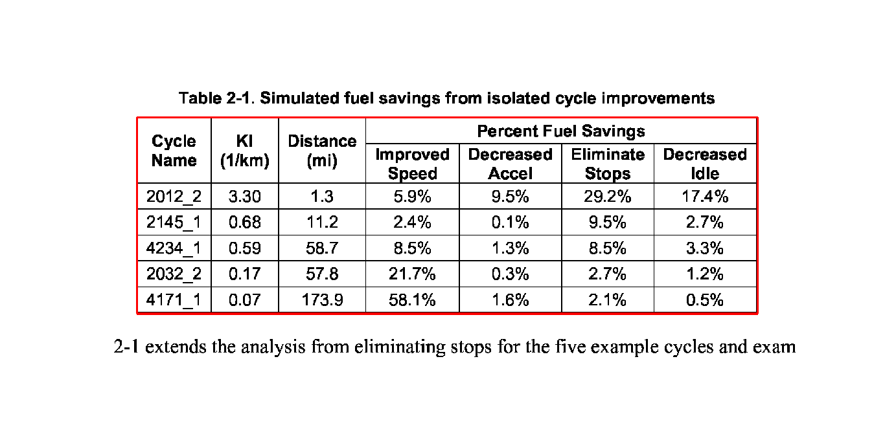
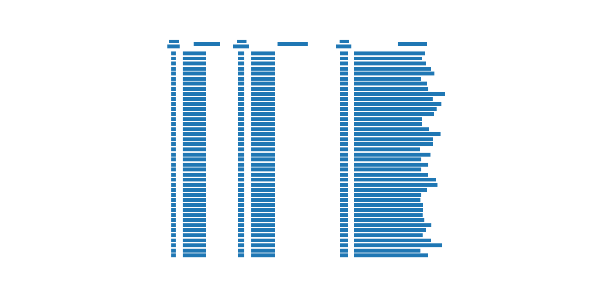

.. _advanced:

Advanced Usage
==============

Lattice
-------

Lattice method is designed to work on pdf files which have tables with well-defined grids. It looks for lines on a page to form a table.

Lattice uses OpenCV to apply a set of morphological transformations (erosion and dilation) to find horizontal and vertical line segments in a pdf page after converting it to an image using imagemagick.

.. note:: Currently, Lattice only works on pdf files that contain text. However, we plan to add `OCR support`_ in the future.

.. _OCR support: https://github.com/socialcopsdev/camelot/issues/14

Let's see how Lattice processes this pdf, step by step.

Line segments are detected in the first step.

.. .. _this: insert link for us-030.pdf

.. image:: ../_static/png/line.png
   :height: 674
   :width: 1366
   :scale: 50%
   :align: left

The detected line segments are overlapped by `and` ing their pixel intensities to find intersections.

.. image:: ../_static/png/intersection.png
   :height: 674
   :width: 1366
   :scale: 50%
   :align: left

The detected line segments are overlapped again, this time by `or` ing their pixel intensities and outermost contours are computed to identify potential table boundaries. This helps Lattice in detecting more than one table on a single page.

Since dimensions of a pdf and its image vary; table contours, intersections and segments are scaled and translated to the pdf's coordinate space. A representation of the table is then created using these scaled coordinates.

.. image:: ../_static/png/table.png
   :height: 674
   :width: 1366
   :scale: 50%
   :align: left

Spanning cells are then detected using the line segments and intersections.

.. image:: ../_static/png/table_span.png
   :height: 674
   :width: 1366
   :scale: 50%
   :align: left

Finally, the characters found on the page are assigned to cells based on their x,y coordinates.

::

    >>> from camelot.pdf import Pdf
    >>> from camelot.lattice import Lattice

    >>> manager = Pdf(Lattice(), 'us-030.pdf')
    >>> tables = manager.extract()
    >>> print tables['page-1']['table-1']['data']

.. csv-table::
   :header: "Cycle Name","KI (1/km)","Distance (mi)","Percent Fuel Savings","","",""

   "","","","Improved Speed","Decreased Accel","Eliminate Stops","Decreased Idle"
   "2012_2","3.30","1.3","5.9%","9.5%","29.2%","17.4%"
   "2145_1","0.68","11.2","2.4%","0.1%","9.5%","2.7%"
   "4234_1","0.59","58.7","8.5%","1.3%","8.5%","3.3%"
   "2032_2","0.17","57.8","21.7%","0.3%","2.7%","1.2%"
   "4171_1","0.07","173.9","58.1%","1.6%","2.1%","0.5%"

Scale
^^^^^

The scale parameter is used to determine the length of the structuring element used for morphological transformations. The length of vertical and horizontal structuring elements are found by dividing the image's height and width respectively, by `scale`. Large `scale` will lead to a smaller structuring element, which means that smaller lines will be detected. The default value for scale is 15.

Let's consider this pdf file.

.. .. _this: insert link for row_span_1.pdf

.. image:: ../_static/png/scale_1.png
   :height: 674
   :width: 1366
   :scale: 50%
   :align: left

Clearly, it couldn't detected those small lines in the lower left part. Therefore, we need to increase the value of scale. Let's try a value of 40.

.. image:: ../_static/png/scale_2.png
   :height: 674
   :width: 1366
   :scale: 50%
   :align: left

Voila! It detected the smaller lines.

Fill
^^^^

In the file used above, you can see that some cells spanned a lot of rows, `fill` just copies the same value to all rows/columns of a spanning cell. You can apply fill horizontally, vertically or both. Let us fill the output for the file we used above, vertically.

::

    >>> from camelot.pdf import Pdf
    >>> from camelot.lattice import Lattice

    >>> manager = Pdf(Lattice(fill=['v'], scale=40), 'row_span_1.pdf')
    >>> tables = manager.extract()
    >>> print tables['page-1']['table-1']['data']

.. csv-table::
   :header: "Plan Type","County","Plan  Name","Totals"

   "GMC","Sacramento","Anthem Blue Cross","164,380"
   "GMC","Sacramento","Health Net","126,547"
   "GMC","Sacramento","Kaiser Foundation","74,620"
   "GMC","Sacramento","Molina Healthcare","59,989"
   "GMC","San Diego","Care 1st Health Plan","71,831"
   "GMC","San Diego","Community...","264,639"
   "GMC","San Diego","Health Net","72,404"
   "GMC","San Diego","Kaiser","50,415"
   "GMC","San Diego","Molina Healthcare","206,430"
   "GMC","Total GMC...","","1,091,255"
   "COHS","Marin","Partnership Health...","36,006"
   "COHS","Mendocino","Partnership Health...","37,243"
   "COHS","Napa","Partnership Health...","28,398"
   "COHS","Solano","Partnership Health...","113,220"
   "COHS","Sonoma","Partnership Health...","112,271"
   "COHS","Yolo","Partnership Health...","52,674"
   "COHS","Del Norte","Partnership Health...","11,242"
   "COHS","Humboldt","Partnership Health...","49,911"
   "COHS","Lake","Partnership Health...","29,149"
   "COHS","Lassen","Partnership Health...","7,360"
   "COHS","Modoc","Partnership Health...","2,940"
   "COHS","Shasta","Partnership Health...","61,763"
   "COHS","Siskiyou","Partnership Health...","16,715"
   "COHS","Trinity","Partnership Health...","4,542"
   "COHS","Merced","Central California...","123,907"
   "COHS","Monterey","Central California...","147,397"
   "COHS","Santa Cruz","Central California...","69,458"
   "COHS","Santa Barbara","CenCal","117,609"
   "COHS","San Luis Obispo","CenCal","55,761"
   "COHS","Orange","CalOptima","783,079"
   "COHS","San Mateo","Health Plan...","113,202"
   "COHS","Ventura","Gold Coast...","202,217"
   "COHS","Total COHS...","","2,176,064"
   "Subtotal for...","","","10,132,022"
   "PCCM","Los Angeles","AIDS Healthcare...","828"
   "PCCM","San Francisco","Family Mosaic","25"
   "PCCM","Total PHP...","","853"
   "All Models...","","","10,132,875"
   "Source: Data...","","",""

Invert
^^^^^^

To find line segments, Lattice needs the lines of the pdf file to be in foreground. So, if you encounter a file like this, just set invert to True.

.. .. _this: insert link for lines_in_background_1.pdf

::

    >>> from camelot.pdf import Pdf
    >>> from camelot.lattice import Lattice

    >>> manager = Pdf(Lattice(invert=True), 'lines_in_background_1.pdf')
    >>> tables = manager.extract()
    >>> print tables['page-1']['table-1']['data']

.. csv-table::
   :header: "State","Date","Halt stations","Halt days","Persons directly reached(in lakh)","Persons trained","Persons counseled","Persons testedfor HIV"

   "Delhi","1.12.2009","8","17","1.29","3,665","2,409","1,000"
   "Rajasthan","2.12.2009 to 19.12.2009","","","","","",""
   "Gujarat","20.12.2009 to 3.1.2010","6","13","6.03","3,810","2,317","1,453"
   "Maharashtra","4.01.2010 to 1.2.2010","13","26","1.27","5,680","9,027","4,153"
   "Karnataka","2.2.2010 to 22.2.2010","11","19","1.80","5,741","3,658","3,183"
   "Kerala","23.2.2010 to 11.3.2010","9","17","1.42","3,559","2,173","855"
   "Total","","47","92","11.81","22,455","19,584","10,644"

Lattice can also parse pdf files with tables like these that are rotated clockwise/anti-clockwise by 90 degrees.

.. .. _these: insert link for left_rotated_table.pdf

You can call Lattice with debug={'line', 'intersection', 'contour', 'table'}, and call `debug_plot()` which will generate an image like the ones on this page, with the help of which you can modify various parameters. See :doc:`API doc <api>` for more information.

Stream
------

Stream method is the complete opposite of Lattice and works on pdf files which have text placed uniformly apart across rows to simulate a table. It looks for spaces between text to form a table representation.

Stream builds on top of PDFMiner's functionality of grouping characters on a page into words and sentences. After getting these words, it groups them into rows based on their y-coordinates and tries to guess the number of columns a pdf table might have by calculating the mode of the number of words in each row. Additionally, the user can specify the number of columns or column x-coordinates.

Let's run it on this pdf.

::

    >>> from camelot.pdf import Pdf
    >>> from camelot.stream import Stream

    >>> manager = Pdf(Stream(), 'eu-027.pdf')
    >>> tables = manager.extract()
    >>> print tables['page-1']['table-1']['data']

.. .. _this: insert link for eu-027.pdf

.. csv-table::

   "C","Appendix C:...","","",""
   "","Table C1:...","","",""
   "","This table...","","",""
   "Variable","Mean","Std. Dev.","Min","Max"
   "Age","50.8","15.9","21","90"
   "Men","0.47","0.50","0","1"
   "East","0.28","0.45","0","1"
   "Rural","0.15","0.36","0","1"
   "Married","0.57","0.50","0","1"
   "Single","0.21","0.40","0","1"
   "Divorced","0.13","0.33","0","1"
   "Widowed","0.08","0.26","0","1"
   "Separated","0.03","0.16","0","1"
   "Partner","0.65","0.48","0","1"
   "Employed","0.55","0.50","0","1"
   "Fulltime","0.34","0.47","0","1"
   "Parttime","0.20","0.40","0","1"
   "Unemployed","0.08","0.28","0","1"
   "Homemaker","0.19","0.40","0","1"
   "Retired","0.28","0.45","0","1"
   "Household size","2.43","1.22","1","9"
   "Households...","0.37","0.48","0","1"
   "Number of...","1.67","1.38","0","8"
   "Lower...","0.08","0.27","0","1"
   "Upper...","0.60","0.49","0","1"
   "Post...","0.12","0.33","0","1"
   "First...","0.17","0.38","0","1"
   "Other...","0.03","0.17","0","1"
   "Household...","2,127","1,389","22","22,500"
   "Gross...","187,281","384,198","0","7,720,000"
   "Gross...","38,855","114,128","0","2,870,000"
   "","Source:...","","",""
   "","","","","ECB"
   "","","","","Working..."
   "","","","","Febuary..."

We can also specify the column x-coordinates. We need to call Stream with debug=True and use matplotlib's interface to note down the column x-coordinates we need. Let's try it on this pdf file.

::

    >>> from camelot.pdf import Pdf
    >>> from camelot.stream import Stream

    >>> manager = Pdf(Stream(debug=True), 'mexican_towns.pdf'), debug=True
    >>> manager.debug_plot()

After getting the x-coordinates, we just need to pass them to Stream, like this.

::

    >>> from camelot.pdf import Pdf
    >>> from camelot.stream import Stream

    >>> manager = Pdf(Stream(columns=['28,67,180,230,425,475,700']), 'mexican_towns.pdf')
    >>> tables = manager.extract()
    >>> print tables['page-1']['table-1']['data']

.. csv-table::

   "Clave","","Clave","","Clave",""
   "","Nombre Entidad","","Nombre Municipio","","Nombre Localidad"
   "Entidad","","Municipio","","Localidad",""
   "01","Aguascalientes","001","Aguascalientes","0094","Granja Adelita"
   "01","Aguascalientes","001","Aguascalientes","0096","Agua Azul"
   "01","Aguascalientes","001","Aguascalientes","0100","Rancho Alegre"
   "01","Aguascalientes","001","Aguascalientes","0102","Los Arbolitos [Rancho]"
   "01","Aguascalientes","001","Aguascalientes","0104","Ardillas de Abajo (Las Ardillas)"
   "01","Aguascalientes","001","Aguascalientes","0106","Arellano"
   "01","Aguascalientes","001","Aguascalientes","0112","Bajío los Vázquez"
   "01","Aguascalientes","001","Aguascalientes","0113","Bajío de Montoro"
   "01","Aguascalientes","001","Aguascalientes","0114","Residencial San Nicolás [Baños la Cantera]"
   "01","Aguascalientes","001","Aguascalientes","0120","Buenavista de Peñuelas"
   "01","Aguascalientes","001","Aguascalientes","0121","Cabecita 3 Marías (Rancho Nuevo)"
   "01","Aguascalientes","001","Aguascalientes","0125","Cañada Grande de Cotorina"
   "01","Aguascalientes","001","Aguascalientes","0126","Cañada Honda [Estación]"
   "01","Aguascalientes","001","Aguascalientes","0127","Los Caños"
   "01","Aguascalientes","001","Aguascalientes","0128","El Cariñán"
   "01","Aguascalientes","001","Aguascalientes","0129","El Carmen [Granja]"
   "01","Aguascalientes","001","Aguascalientes","0135","El Cedazo (Cedazo de San Antonio)"
   "01","Aguascalientes","001","Aguascalientes","0138","Centro de Arriba (El Taray)"
   "01","Aguascalientes","001","Aguascalientes","0139","Cieneguilla (La Lumbrera)"
   "01","Aguascalientes","001","Aguascalientes","0141","Cobos"
   "01","Aguascalientes","001","Aguascalientes","0144","El Colorado (El Soyatal)"
   "01","Aguascalientes","001","Aguascalientes","0146","El Conejal"
   "01","Aguascalientes","001","Aguascalientes","0157","Cotorina de Abajo"
   "01","Aguascalientes","001","Aguascalientes","0162","Coyotes"
   "01","Aguascalientes","001","Aguascalientes","0166","La Huerta (La Cruz)"
   "01","Aguascalientes","001","Aguascalientes","0170","Cuauhtémoc (Las Palomas)"
   "01","Aguascalientes","001","Aguascalientes","0171","Los Cuervos (Los Ojos de Agua)"
   "01","Aguascalientes","001","Aguascalientes","0172","San José [Granja]"
   "01","Aguascalientes","001","Aguascalientes","0176","La Chiripa"
   "01","Aguascalientes","001","Aguascalientes","0182","Dolores"
   "01","Aguascalientes","001","Aguascalientes","0183","Los Dolores"
   "01","Aguascalientes","001","Aguascalientes","0190","El Duraznillo"
   "01","Aguascalientes","001","Aguascalientes","0191","Los Durón"
   "01","Aguascalientes","001","Aguascalientes","0197","La Escondida"
   "01","Aguascalientes","001","Aguascalientes","0201","Brande Vin [Bodegas]"
   "01","Aguascalientes","001","Aguascalientes","0207","Valle Redondo"
   "01","Aguascalientes","001","Aguascalientes","0209","La Fortuna"
   "01","Aguascalientes","001","Aguascalientes","0212","Lomas del Gachupín"
   "01","Aguascalientes","001","Aguascalientes","0213","El Carmen (Gallinas Güeras) [Rancho]"
   "01","Aguascalientes","001","Aguascalientes","0216","La Gloria"