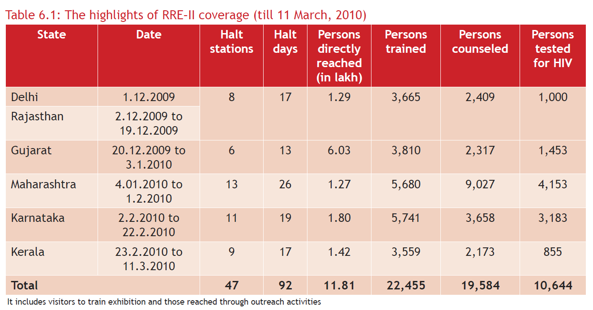
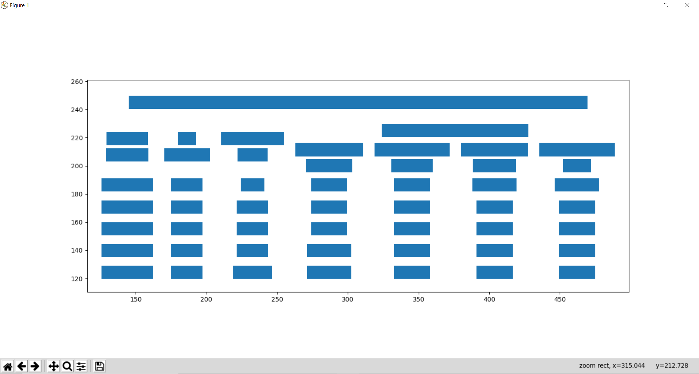
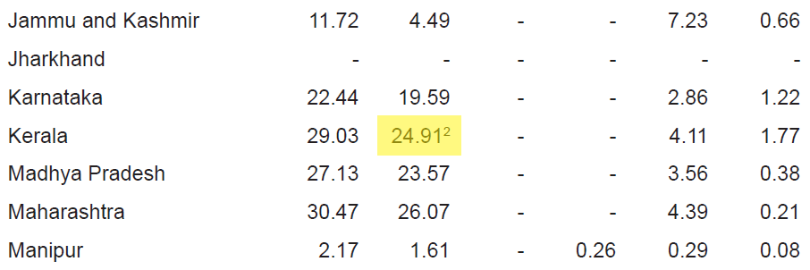

.. _advanced:

Advanced Usage
==============

This page covers some of the more advanced configurations for :ref:`Stream <stream>` and :ref:`Lattice <lattice>`.

Process background lines
------------------------

To detect line segments, :ref:`Lattice <lattice>` needs the lines that make the table, to be in foreground. Here's an example of a table with lines in background.

Source: `PDF <../_static/pdf/background_lines.pdf>`__

To process background lines, you can pass ``process_background=True``.

::

    >>> tables = camelot.read_pdf('background_lines.pdf', mesh=True, process_background=True)
    >>> tables[1].df

.. csv-table::
  :file: ../_static/csv/background_lines.csv

Plot geometry
-------------

You can use the :meth:`plot_geometry() <camelot.plot_geometry>` method to plot various geometries that were detected by Camelot while processing the PDF page. This can help you select table areas, column separators and debug bad table outputs, by tweaking different configuration parameters.

The following geometries are available for plotting. You can pass them to the :meth:`plot_geometry() <camelot.plot_geometry>` method with the ``geometry_type`` keyword argument, which will then generate a `matplotlib <https://matplotlib.org/>`_ plot.

- '`text <geometry_text>`_'
- '`table <geometry_table>`_'
- '`contour <geometry_contour>`_'
- '`line <geometry_line>`_'
- '`joint <geometry_joint>`_'

.. note:: The last three geometries can only be used with :ref:`Lattice <lattice>`, i.e. when ``mesh=True``.

Let's generate a plot for each geometry using this `PDF <_static/pdf/foo.pdf>`__ as an example.

.. warning:: Using multiple pages in :meth:`plot_geometry() <camelot.plot_geometry>`

    By default, :meth:`plot_geometry() <camelot.plot_geometry>` will use the first page of the PDF. Since this method is useful only for debugging, it makes sense to use it for one page at a time. If you pass a page range to this method, multiple plots will be generated one by one, each popping up as you close the previous one. To abort, you can use ``Ctrl + C``.

.. _geometry_text:

text
^^^^

Passing ``geometry_type=text`` creates a plot for all the text present on a PDF page. This, as we shall later see, is very helpful with :ref:`Stream <stream>`_, when you have to choose specific table areas to parse or have to specify your own column separators in case the Stream method cannot guess them correctly.

::

    >>> camelot.plot_geometry('foo.pdf', geometry_type='text')

.. _geometry_table:

table
^^^^^

Passing ``geometry_type=text`` creates a plot for tables detected on a PDF page. This geometry, along with contour, line and joint is useful for debugging and improving the parsing output, as we shall see later.

::

    >>> camelot.plot_geometry('foo.pdf', mesh=True, geometry_type='table')

.. figure:: ../_static/png/geometry_table.png
   :height: 674
   :width: 1366
   :scale: 50%
   :align: left

.. _geometry_contour:

contour
^^^^^^^

Passing ``geometry_type=text`` creates a plot for table boundaries detected on a PDF page.

::

    >>> camelot.plot_geometry('foo.pdf', mesh=True, geometry_type='contour')

.. figure:: ../_static/png/geometry_contour.png
   :height: 674
   :width: 1366
   :scale: 50%
   :align: left

.. _geometry_line:

line
^^^^

Passing ``geometry_type=text`` creates a plot for lines detected on a PDF page.

::

    >>> camelot.plot_geometry('foo.pdf', geometry_type='line')

.. figure:: ../_static/png/geometry_line.png
   :height: 674
   :width: 1366
   :scale: 50%
   :align: left

.. _geometry_joint:

joint
^^^^^

Passing ``geometry_type=text`` creates a plot for line intersections detected on a PDF page.

::

    >>> camelot.plot_geometry('foo.pdf', mesh=True, geometry_type='joint')

.. figure:: ../_static/png/geometry_joint.png
   :height: 674
   :width: 1366
   :scale: 50%
   :align: left

Specify table areas
-------------------

Since :ref:`Stream <stream>` treats the whole page as a table, `for now`_, it's useful to specify table boundaries in cases such as this `PDF <_static/pdf/table_areas.pdf>`__. You can plot the `text <geometry_text>`_ on this page and note the left-top and right-bottom coordinates of the table.

Table areas that you want Camelot to analyze can be passed as a list of comma-separated strings to :meth:`read_pdf() <camelot.read_pdf>`.

.. _for now: https://github.com/socialcopsdev/camelot/issues/102

::

    >>> tables = camelot.read_pdf('table_areas.pdf', table_areas=['316,499,566,337'])
    >>> tables[0].df

.. csv-table::
  :file: ../_static/csv/table_areas.csv

Specify column separators
-------------------------

In cases like this `PDF <_static/pdf/column_separators.pdf>`__, where the text is very close to each other, it is possible that Camelot may guess the column separator coordinates incorrectly. To correct this, you can explicitly specify the *x* coordinate for each column separator by plotting the `text <geometry_text>`_ on the page.

You can pass the column separators as a list of comma-separated strings to :meth:`read_pdf() <camelot.read_pdf>`.

In case you passed a single column separators string list, and no table area is specified, the separators will be applied to the whole page. When a list of table areas is specified and there is a need to specify column separators as well, the length of both lists should be equal, each table area will be mapped to each column separator string using their indices.

If you have specified two table areas, ``table_areas=['12,23,43,54', '20,33,55,67']``, and only want to specify column separators for the first table (since you can see by looking at the table that Camelot will be able to get it perfectly!), you can pass an empty string for the second table in the column separators' list, like this, ``columns=['10,120,200,400', '']``.

Let's get back to the *x* coordinates we got from plotting `text <geometry_text>`_ that exists on this `PDF <_static/pdf/column_separators.pdf>`__, and get the table out!

::

    >>> tables = camelot.read_pdf('column_separators.pdf', columns=['72,95,209,327,442,529,566,606,683'])
    >>> tables[0].df

.. csv-table::

    "...","...","...","...","...","...","...","...","...","..."
    "LICENSE","","","","PREMISE","","","","",""
    "NUMBER TYPE DBA NAME","","","LICENSEE NAME","ADDRESS","CITY","ST","ZIP","PHONE NUMBER","EXPIRES"
    "...","...","...","...","...","...","...","...","...","..."

Ah! Since `PDFMiner <https://euske.github.io/pdfminer/>`_ merged the strings, "NUMBER", "TYPE" and "DBA NAME", all of them were assigned to the same cell. Let's see how we can fix this in the next section.

Split text along separators
---------------------------

To deal with cases like the output from the previous section, you can pass ``split_text=True`` to :meth:`read_pdf() <camelot.read_pdf>`, which will split any strings that lie in different cells but have been assigned to the a single cell (as a result of being merged together by `PDFMiner <https://euske.github.io/pdfminer/>`_).

::

    >>> tables = camelot.read_pdf('column_separators.pdf', columns=['72,95,209,327,442,529,566,606,683'], split_text=True)
    >>> tables[0].df

.. csv-table::

    "...","...","...","...","...","...","...","...","...","..."
    "LICENSE","","","","PREMISE","","","","",""
    "NUMBER","TYPE","DBA NAME","LICENSEE NAME","ADDRESS","CITY","ST","ZIP","PHONE NUMBER","EXPIRES"
    "...","...","...","...","...","...","...","...","...","..."

Flag subscripts and superscripts
--------------------------------

There might be cases where you want to differentiate between the text and superscripts and subscripts, like this `PDF <_static/pdf/superscript.pdf>`_.

In this case, the text that `other tools`_ return, will be ``24.912``. This is harmless as long as there is that decimal point involved. When it isn't, you'll be left wondering why the results of your data analysis were 10x bigger!

You can solve this by passing ``flag_size=True``, which will enclose the superscripts and subscripts with ``<s></s>``, based on font size, as shown below.

.. _other tools: https://github.com/socialcopsdev/camelot/wiki/Comparison-with-other-PDF-Table-Parsing-libraries-and-tools

::

    >>> tables = camelot.read_pdf('superscript.pdf', flag_size=True)
    >>> tables[0].df

.. csv-table::

    "...","...","...","...","...","...","...","...","...","...","..."
    "Karnataka","22.44","19.59","-","-","2.86","1.22","-","0.89","-","0.69"
    "Kerala","29.03","24.91<s>2</s>","-","-","4.11","1.77","-","0.48","-","1.45"
    "Madhya Pradesh","27.13","23.57","-","-","3.56","0.38","-","1.86","-","1.28"
    "...","...","...","...","...","...","...","...","...","...","..."

Control how text is grouped into rows
-------------------------------------

You can pass ``row_close_tol=<+int>`` to group the rows closer together, as shown below.

::

    >>> tables = camelot.read_pdf('group_rows.pdf')
    >>> tables[0].df

.. csv-table::

    "Clave","","Clave","","","Clave",""
    "","Nombre Entidad","","","Nombre Municipio","","Nombre Localidad"
    "Entidad","","Municipio","","","Localidad",""
    "01","Aguascalientes","001","Aguascalientes","","0094","Granja Adelita"
    "01","Aguascalientes","001","Aguascalientes","","0096","Agua Azul"
    "01","Aguascalientes","001","Aguascalientes","","0100","Rancho Alegre"

::

    >>> tables = camelot.read_pdf('group_rows.pdf', row_close_tol=10)
    >>> tables[0].df

.. csv-table::

    "Clave","Nombre Entidad","Clave","","Nombre Municipio","Clave","Nombre Localidad"
    "Entidad","","Municipio","","","Localidad",""
    "01","Aguascalientes","001","Aguascalientes","","0094","Granja Adelita"
    "01","Aguascalientes","001","Aguascalientes","","0096","Agua Azul"
    "01","Aguascalientes","001","Aguascalientes","","0100","Rancho Alegre"

Detect short lines
------------------

There might be cases while using :ref:`Lattice <lattice>` when smaller lines don't get detected. The size of the smallest line that gets detected is calculated by dividing the PDF page's dimensions with a scaling factor called ``line_size_scaling``. By default, its value is 15.

As you can already guess, the larger the ``line_size_scaling``, the smaller the size of lines getting detected.

.. warning:: Making ``line_size_scaling`` very large (>150) will lead to text getting detected as lines.

Here's one `PDF <_static/pdf/short_lines.pdf>`__ where small lines separating the the headers don't get detected with the default value of 15. Let's `plot the table <geometry_table>`_ for this PDF.

.. figure:: ../_static/png/short_lines.png
   :align: left

::

    >>> camelot.plot_geometry('short_lines.pdf', mesh=True, geometry_type='table')

Clearly, the smaller lines separating the headers, couldn't be detected. Let's try with ``line_size_scaling=40``, and `plot the table <geometry_table>`_ again.

::

    >>> camelot.plot_geometry('short_lines.pdf', mesh=True, geometry_type='table', line_size_scaling=40)

Voila! Camelot can now see those lines. Let's using this value in :meth:`read_pdf() <camelot.read_pdf>` and get our table.

::

    >>> tables = camelot.read_pdf('short_lines.pdf', mesh=True, line_size_scaling=40)
    >>> tables[0].df

.. csv-table::

    "Investigations","No. ofHHs","Age/Sex/Physiological  Group","Preva-lence","C.I*","RelativePrecision","Sample sizeper State"
    "Anthropometry","2400","All ...","","","",""
    "Clinical Examination","","","","","",""
    "History of morbidity","","","","","",""
    "Diet survey","1200","All ...","","","",""
    "Blood Pressure #","2400","Men (≥ 18yrs)","10%","95%","20%","1728"
    "","","Women (≥ 18 yrs)","","","","1728"
    "Fasting blood glucose","2400","Men (≥ 18 yrs)","5%","95%","20%","1825"
    "","","Women (≥ 18 yrs)","","","","1825"
    "Knowledge &Practices on HTN &DM","2400","Men (≥ 18 yrs)","-","-","-","1728"
    "","2400","Women (≥ 18 yrs)","-","-","-","1728"

Shift text in spanning cells
----------------------------

By default, the :ref:`Lattice <lattice>` method shifts text in spanning cells, first to the left and then to the top, as you can observe in the output table above. However, this behavior can be changed using the ``shift_text`` keyword argument. Think of it as setting the *gravity* for a table, it decides where the text moves and finally comes to rest.

``shift_text`` expects a list with one or more characters from the following set: ``('', l', 'r', 't', 'b')``, which are then applied *in order*. The default, as we discussed above, is ``['l', 't']``.

We'll use the `PDF <_static/pdf/short_lines.pdf>`__ from the previous example. Let's pass ``shift_text=['']``, which basically means that the text will experience weightlessness! (It will remain in place.)

.. figure:: ../_static/png/short_lines.png
   :align: left

::

    >>> tables = camelot.read_pdf('short_lines.pdf', mesh=True, line_size_scaling=40, shift_text=[''])
    >>> tables[0].df

.. csv-table::

    "Investigations","No. ofHHs","Age/Sex/Physiological  Group","Preva-lence","C.I*","RelativePrecision","Sample sizeper State"
    "Anthropometry","","","","","",""
    "Clinical Examination","2400","","All ...","","",""
    "History of morbidity","","","","","",""
    "Diet survey","1200","","All ...","","",""
    "","","Men (≥ 18yrs)","","","","1728"
    "Blood Pressure #","2400","Women (≥ 18 yrs)","10%","95%","20%","1728"
    "","","Men (≥ 18 yrs)","","","","1825"
    "Fasting blood glucose","2400","Women (≥ 18 yrs)","5%","95%","20%","1825"
    "Knowledge &Practices on HTN &","2400","Men (≥ 18 yrs)","-","-","-","1728"
    "DM","2400","Women (≥ 18 yrs)","-","-","-","1728"

No surprises there, it did remain in place. Let's pass ``shift_text=['r', 'b']``, to set the *gravity* to right-bottom, and move the text in that direction.

::

    >>> tables = camelot.read_pdf('short_lines.pdf', mesh=True, line_size_scaling=40, shift_text=['r', 'b'])
    >>> tables[0].df

.. csv-table::

    "Investigations","No. ofHHs","Age/Sex/Physiological  Group","Preva-lence","C.I*","RelativePrecision","Sample sizeper State"
    "Anthropometry","","","","","",""
    "Clinical Examination","","","","","",""
    "History of morbidity","2400","","","","","All ..."
    "Diet survey","1200","","","","","All ..."
    "","","Men (≥ 18yrs)","","","","1728"
    "Blood Pressure #","2400","Women (≥ 18 yrs)","10%","95%","20%","1728"
    "","","Men (≥ 18 yrs)","","","","1825"
    "Fasting blood glucose","2400","Women (≥ 18 yrs)","5%","95%","20%","1825"
    "","2400","Men (≥ 18 yrs)","-","-","-","1728"
    "Knowledge &Practices on HTN &DM","2400","Women (≥ 18 yrs)","-","-","-","1728"

Copy text in spanning cells
---------------------------

You can copy text in spanning cells when using :ref:`Lattice <lattice>`, in either horizontal or vertical direction or both. This behavior is disabled by default.

``copy_text`` expects a list with one or more characters from the following set: ``('v', 'h')``, which are then applied *in order*.

Let's try it out on this `PDF <_static/pdf/copy_text.pdf>`__. First, let's check out the output table to see if we need to use any other configuration parameters.

::

    >>> tables = camelot.read_pdf('copy_text.pdf', mesh=True)
    >>> tables[0].df

.. csv-table::

    "Sl. No.","Name of State/UT","Name of District","Disease/ Illness","No. of Cases","No. of Deaths","Date of start of outbreak","Date of reporting","Current Status","..."
    "1","Kerala","Kollam","i.  Food Poisoning","19","0","31/12/13","03/01/14","Under control","..."
    "2","Maharashtra","Beed","i.  Dengue & Chikungunya   i","11","0","03/01/14","04/01/14","Under control","..."
    "3","Odisha","Kalahandi","iii. Food Poisoning","42","0","02/01/14","03/01/14","Under control","..."
    "4","West Bengal","West Medinipur","iv. Acute Diarrhoeal Disease","145","0","04/01/14","05/01/14","Under control","..."
    "","","Birbhum","v.  Food Poisoning","199","0","31/12/13","31/12/13","Under control","..."
    "","","Howrah","vi. Viral Hepatitis A &E","85","0","26/12/13","27/12/13","Under surveillance","..."

We don't need anything else. Now, let's pass ``copy_text=['v']`` to copy text in the vertical direction. This can save you some time by not having to do this in your cleaning script!

::

    >>> tables = camelot.read_pdf('copy_text.pdf', mesh=True, copy_text=['v'])
    >>> tables[0].df

.. csv-table::

    "Sl. No.","Name of State/UT","Name of District","Disease/ Illness","No. of Cases","No. of Deaths","Date of start of outbreak","Date of reporting","Current Status","..."
    "1","Kerala","Kollam","i.  Food Poisoning","19","0","31/12/13","03/01/14","Under control","..."
    "2","Maharashtra","Beed","i.  Dengue & Chikungunya   i","11","0","03/01/14","04/01/14","Under control","..."
    "3","Odisha","Kalahandi","iii. Food Poisoning","42","0","02/01/14","03/01/14","Under control","..."
    "4","West Bengal","West Medinipur","iv. Acute Diarrhoeal Disease","145","0","04/01/14","05/01/14","Under control","..."
    "4","West Bengal","Birbhum","v.  Food Poisoning","199","0","31/12/13","31/12/13","Under control","..."
    "4","West Bengal","Howrah","vi. Viral Hepatitis A &E","85","0","26/12/13","27/12/13","Under surveillance","..."