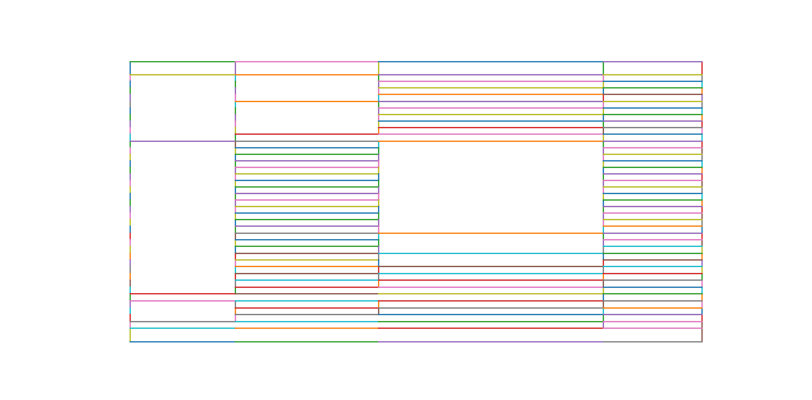

.. _advanced:

Advanced Usage
==============

This page covers some of the more advanced configurations for :ref:`Stream <stream>` and :ref:`Lattice <lattice>`.

Process background lines
------------------------

https://github.com/socialcopsdev/camelot/blob/docs/docs/benchmark/lattice/background_lines_1/background_lines_1.pdf

To find line segments, Lattice needs the lines of the pdf file to be in foreground. So, if you encounter a file like this, just set invert to True.

::

    >>> from camelot.pdf import Pdf
    >>> from camelot.lattice import Lattice

    >>> manager = Pdf(Lattice(invert=True), 'lines_in_background_1.pdf')
    >>> tables = manager.extract()
    >>> print tables['page-1']['table-1']['data']

Plot geometry
-------------

https://github.com/socialcopsdev/camelot/blob/docs/docs/benchmark/stream/us-007/us-007.pdf

You can call Lattice with debug={'line', 'intersection', 'contour', 'table'}, and call `debug_plot()` which will generate an image like the ones on this page, with the help of which you can modify various parameters. See :doc:`API doc <api>` for more information.

Specify table areas
-------------------

https://github.com/socialcopsdev/camelot/blob/docs/docs/benchmark/stream/us-007/us-007.pdf

Specify column separators
-------------------------

https://github.com/socialcopsdev/camelot/blob/docs/docs/benchmark/stream/m27/m27.pdf

Split text along separators
---------------------------

https://github.com/socialcopsdev/camelot/blob/docs/docs/benchmark/stream/m27/m27.pdf

Flag subscripts and superscripts
--------------------------------

https://github.com/socialcopsdev/camelot/blob/docs/docs/benchmark/stream/superscript/superscript.pdf

Control how text is grouped into rows
-------------------------------------

https://github.com/socialcopsdev/camelot/blob/docs/docs/benchmark/stream/mexican_towns/mexican_towns.pdf

Detect short lines
------------------

https://github.com/socialcopsdev/camelot/blob/docs/docs/benchmark/lattice/row_span/row_span.pdf

The scale parameter is used to determine the length of the structuring element used for morphological transformations. The length of vertical and horizontal structuring elements are found by dividing the image's height and width respectively, by `scale`. Large `scale` will lead to a smaller structuring element, which means that smaller lines will be detected. The default value for scale is 15.

Let's consider this pdf file.

.. .. _this: insert link for row_span_1.pdf

.. image:: ../_static/png/scale_1.png
   :height: 674
   :width: 1366
   :scale: 50%
   :align: left

Clearly, it couldn't detected those small lines in the lower left part. Therefore, we need to increase the value of scale. Let's try a value of 40.

Voila! It detected the smaller lines.

Copy text in spanning cells
---------------------------

https://github.com/socialcopsdev/camelot/blob/docs/docs/benchmark/lattice/row_span/row_span.pdf

In the file used above, you can see that some cells spanned a lot of rows, `fill` just copies the same value to all rows/columns of a spanning cell. You can apply fill horizontally, vertically or both. Let us fill the output for the file we used above, vertically.

::

    >>> from camelot.pdf import Pdf
    >>> from camelot.lattice import Lattice

    >>> manager = Pdf(Lattice(fill=['v'], scale=40), 'row_span_1.pdf')
    >>> tables = manager.extract()
    >>> print tables['page-1']['table-1']['data']

Shift text in spanning cells
----------------------------

https://github.com/socialcopsdev/camelot/blob/docs/docs/benchmark/stream/m27/m27.pdf