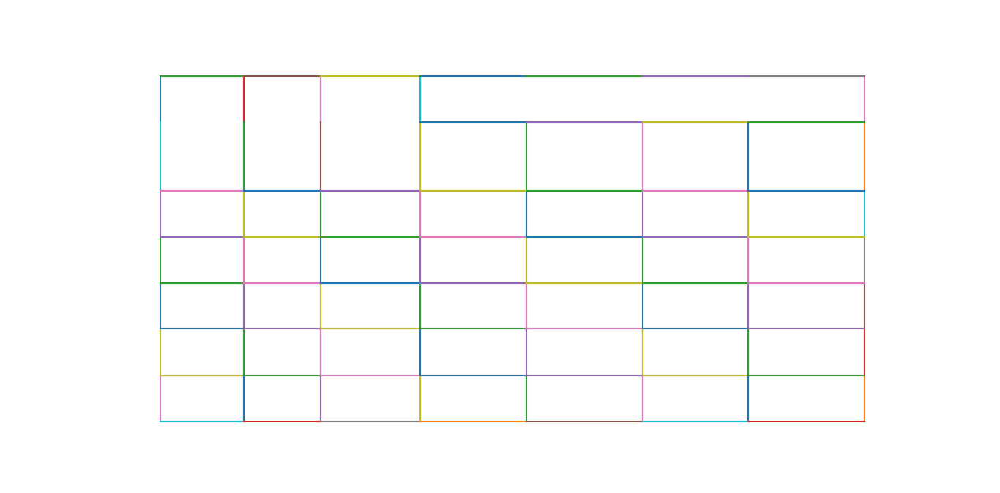

.. _how_it_works:

How It Works
============

This part of the documentation includees a high-level explanation of how Camelot extracts tables from PDF files.

You can choose between two table parsing methods, *Stream* and *Lattice*. These names for parsing methods inside Camelot were inspired from `Tabula`_.

.. _Tabula: https://github.com/tabulapdf/tabula

.. _stream:

Stream
------

Stream can be used to parse tables that have whitespaces between cells to simulate a table structure. It looks for these spaces between text to form a table representation.

It is built on top of PDFMiner's functionality of grouping characters on a page into words and sentences, using `margins`_. After getting the words on a page, it groups them into rows based on their *y* coordinates. It then tries to guess the number of columns the table might have by calculating the mode of the number of words in each row. This mode is used to calculate *x* ranges for the table's columns. It then adds columns to this column range list based on any words that may lie outside or inside the current column *x* ranges.

.. _margins: https://euske.github.io/pdfminer/#tools

.. note:: By default, Stream treats the whole PDF page as a table, which isn't ideal when there are more than two tables on a page with different number of columns. Automatic table detection for Stream is `in the works`_.

.. _in the works: https://github.com/socialcopsdev/camelot/issues/102

.. _lattice:

Lattice
-------

Lattice is more deterministic in nature, and it does not rely on guesses. It can be used to parse tables that have demarcated lines between cells, and it can automatically parse multiple tables present on a page.

It starts by converting the PDF page to an image using ghostscript, and then processes it to get horizontal and vertical line segments by applying a set of morphological transformations (erosion and dilation) using OpenCV.

Let's see how Lattice processes the second page of `this PDF`_, step-by-step.

.. _this PDF: ../_static/pdf/us-030.pdf

1. Line segments are detected.

.. image:: ../_static/png/geometry_line.png
    :height: 674
    :width: 1366
    :scale: 50%
    :align: left

2. Line intersections are detected, by overlapping the detected line segments and "`and`_"ing their pixel intensities.

.. _and: https://en.wikipedia.org/wiki/Logical_conjunction

.. image:: ../_static/png/geometry_joint.png
    :height: 674
    :width: 1366
    :scale: 50%
    :align: left

3. Table boundaries are computed by overlapping the detected line segments again, this time by "`or`_"ing their pixel intensities.

.. _or: https://en.wikipedia.org/wiki/Logical_disjunction

.. image:: ../_static/png/geometry_contour.png
    :height: 674
    :width: 1366
    :scale: 50%
    :align: left

4. Since dimensions of the PDF page and its image vary, the detected table boundaries, line intersections, and line segments are scaled and translated to the PDF page's coordinate space, and a representation of the table is created.

.. image:: ../_static/png/table.png
    :height: 674
    :width: 1366
    :scale: 50%
    :align: left

5. Spanning cells are detected using the line segments and line intersections.

6. Finally, the words found on the page are assigned to the table's cells based on their *x* and *y* coordinates.